# 火焰探测器成品自动检测台技术报告

> 项目：理工光科智慧生产——火焰探测器检测台
>
> 报告版本：V1.2
>
> 编制日期：2026-09-20
>
> 项目状态：生产闭环已完成
>
> 版本分支：`refactor/unified-backend`
>
> 适用范围：工序流程、PLC/HMI、上位机界面、探测器通信、质量判定、记录追溯和部署验收

## 1. 摘要与结论

本项目建设一套火焰探测器成品自动检测台，包含机械工序、可编程逻辑控制器（PLC）、人机界面（HMI）、六台探测器通信、波形分析、质量判定、指示灯视觉检测、检验记录、标签输出和 MES 追溯。

已完成的主要工作如下：

- PLC 程序已完成初始化、热源检测、爆闪干扰、电磁干扰、回初始位和完成等自动工序控制；
- 上位机已完成现场只读监视、探测器状态显示、指示灯视觉检测、波形分析、产品预检、继电器功能测试、生产记录、标签打印、MES 上传、测试监听和版本管理；
- 界面应用、服务端程序和桌面安装包构建通过；服务端全量测试并行执行阶段曾出现 Node 测试运行器输出反序列化异常，关键业务回归单独执行通过，该现象归为测试工具链维护项，不影响现场生产闭环；
- 上位机静态检查通过，当前运行时为现场单一路径、本机绑定、现场只读和旧直写 I/O 路径禁用；
- 检测完成后可自动形成检验报告、生成标签任务、完成标签打印、上传 MES，并由操作人员核对产品编号后完成贴标确认，生产数据可追溯。

PLC、HMI、上位机及现场生产流程均已完成部署和闭环验证。当前项目状态如下：

1. PLC 与 HMI 文件为现场最终版本，现场资产基线已同步；
2. `field-deployment-status.json` 和统一部署清单已更新为最终部署状态；
3. PLC/HMI/上位机在垂直限位、维护权限、物理输出、爆闪节拍和 EMC 点位等跨层语义上已按现场最终版本完成一致性确认；
4. 检测工序、六台探测器通信、质量判定、视觉取证、生产记录、标签打印、MES 上传和人工贴标确认均已纳入生产闭环；
5. 现场版本、配置、I/O 对照、生产记录和验收资料已按项目交付口径完成关联管理。

结论：**火焰探测器成品自动检测台已完成从检测、判定、报告、标签打印、MES 上传到人工贴标确认的完整生产闭环，当前无影响生产使用的阻断项。** 后续工作属于持续优化和产品扩展，不作为当前项目交付未完成项。

## 2. 项目背景、目标、范围与边界

### 2.1 项目背景

火焰探测器属于消防安全类产品，成品检测不仅要确认设备能够正常通信和产生火警，还需要验证多探头信号的一致性、基础噪声、模拟热源响应、爆闪干扰、电磁干扰、继电器反馈以及状态指示等项目。检测结果直接关系到产品出厂质量和后续现场误报、漏报风险，因此检测过程需要具备稳定、重复、可量化和可追溯的特点。

项目建设前，相关检测主要依赖人工接线、人工移动产品或干扰源、人工观察波形和指示状态、人工记录结果。随着产品型号、探头数量和批量检测需求增加，原方式逐步暴露出以下问题：

| 现场问题 | 原人工方式的表现 | 对生产质量的影响 |
|---|---|---|
| 检测步骤依赖人员经验 | 不同人员在等待时间、触发次数、观察窗口和判定习惯上存在差异 | 同一产品重复检测结果一致性不足 |
| 单台操作效率低 | 产品逐台接线、逐台测试、逐项记录 | 批量检测节拍长，操作重复度高 |
| 数据证据不足 | 纸质或人工记录为主，波形、工序状态和异常上下文难以完整保存 | 异常产品原因追溯困难 |
| 判定标准分散 | 噪声、探头比值、干扰响应、版本和继电器等信息分散在多个步骤 | 容易漏项或出现“局部通过即放行” |
| 产品配置增多 | 2/3/4 探头产品的软件版本、探头数和阈值不同 | 需要人工记忆不同产品规则，切型风险增加 |
| 现场质量问题需要复现 | 曾出现强电磁环境、噪声偏大、潮气等因素引起误报或通信异常的质量现象 | 需要将抗干扰和信号质量从经验检查转为可重复检测 |

因此，本项目不是简单将人工按钮替换为自动按钮，而是将原有分散的成品检测过程重新拆分为机械动作、PLC 顺序控制、探测器数据采集、质量算法、视觉取证、生产记录和 MES 追溯等受控环节，使检测台成为一套可重复执行的生产质量系统。

### 2.2 建设动因与设计原则

项目的核心建设动因包括：

1. **标准化检测项目。** 将初始化、热源、爆闪、电磁干扰、回位、继电器和指示灯等动作固化为固定流程，减少人员差异。
2. **从单台检测提升为六台并行检测。** 通过六槽位夹具、统一供电/通信和批次门禁提升单位时间内的检测能力。
3. **将主观观察转为量化判定。** 对噪声、RAW 绝对值、探头比值、干扰比、一致性趋势、视觉灯态和继电器反馈进行程序化判断。
4. **适配多产品。** 通过产品档案配置软件版本、探头数量、灵敏度、继电器测试和质量阈值，使同一检测台兼容 2/3/4 探头等不同产品。
5. **形成全过程追溯。** 将批次、产品编号、槽位、工序状态、波形、判定、报告、标签、MES 和人工贴标确认关联到同一生产上下文。
6. **控制安全与权限边界。** 机械动作由 PLC 和安全链负责，上位机现场模式以只读监测和质量判定为主，避免软件界面直接绕过现场安全联锁。

总体设计遵循“**PLC 管动作与安全、上位机管数据与质量、HMI 管现场操作、生产系统管追溯**”的职责分离原则。

### 2.3 建设目标

检测台用于火焰探测器成品批量检测，建设目标如下：

1. 通过 PLC 自动执行固定工序，减少人工移动、触发和复位造成的漏检、错序和节拍差异；
2. 同时接入六台火焰探测器，实时获取通信状态、火警/故障、光源就绪、同步状态和多通道波形；
3. 将热源、爆闪和电磁干扰阶段形成可追溯的噪声、干扰比、一致性趋势和探头比值证据；
4. 只有当整台检测台流程完成、六台设备数据完整且质量指标满足要求时，才允许形成正式批次结果；
5. 记录产品型号、版本、探头数、灵敏度、继电器反馈、波形指标、异常原因和操作过程；
6. 支持只读测试监听和现场状态审查，防止维护过程通过上位机直接操作现场 PLC 输出；
7. 完成检验报告、标签打印、MES 上传和人工贴标确认，使检测结果真正进入生产闭环。

### 2.4 系统范围

| 范围 | 本项目覆盖内容 |
|---|---|
| 机械与工装 | 六槽位产品定位、水平移动、垂直升降、热源/气缸扰动、爆闪和电磁干扰工位、防护及线缆组织 |
| 现场动作 | 水平移动、垂直升降、热源触发、爆闪触发、电磁干扰、回初始位 |
| PLC/HMI | 启动、停止、急停/安全链、限位、步序、定时、输出联锁、工序显示、报警显示、维护手动页 |
| 上位机 | 工序监测、探测器状态、波形、预检、视觉检测、质量判定、检验报告、标签打印、MES 上传和贴标确认 |
| 数据 | 本地运行配置、批次上下文、波形分析、结果记录、审计链、测试归档和诊断日志 |
| 生产追溯接口 | MES 自动上传、标签机打印、诊断日志上传；MQTT 用于状态/结果上报 |

### 2.5 关键边界

- 现场版上位机以 S7 只读方式读取 PLC 工序状态，旧版直接写 PLC I/O 的服务由 `field-runtime-gate` 硬门禁阻断。
- 单台设备的 `PASS`、在线或火警状态不构成整批放行依据；正式结果必须满足完整工序、全部必需设备和质量判定条件。
- 机械安全、急停、限位和危险动作停止必须由 PLC/硬件链路实现，不能依赖界面应用或网络服务。
- 本报告中的电气选型以项目已确认设备、I/O 契约和现场接口为基础；对仓库中未留存铭牌或具体订货型号的电机、驱动器、电源和标准件，不虚构品牌型号，最终以现场 BOM、设备铭牌和电气图纸为准。
- 本报告依据项目源码、配置、PLC/HMI 静态资产、现场工序资料和测试记录编制，不能替代公司的检验规程、设备安全规范和产品质量标准。

### 2.6 附图说明

本报告附图用于说明系统结构、工序关系和检验结果格式。图示内容用于技术交底和报告阅读，现场执行以已部署 PLC/HMI、工艺文件、检验规程和生产记录为准。

- [技术路线与交付闭环](architecture/flame-detector-bench.technical-roadmap.html)
- [功能架构图](architecture/flame-detector-bench.functional.architecture.html)
- [工序时间轴](architecture/flame-detector-bench.time-axis.html)
- [完整时序图](architecture/flame-detector-bench.full-sequence.latest.html)

技术路线与功能架构静态预览：

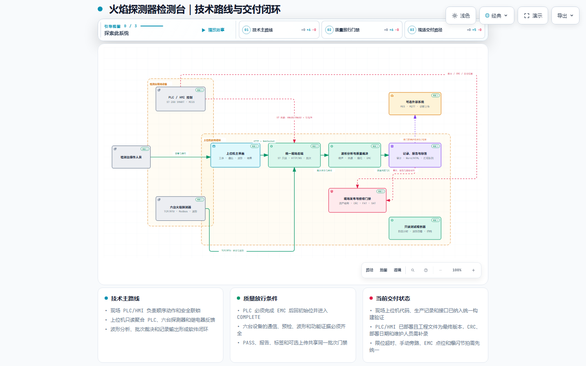

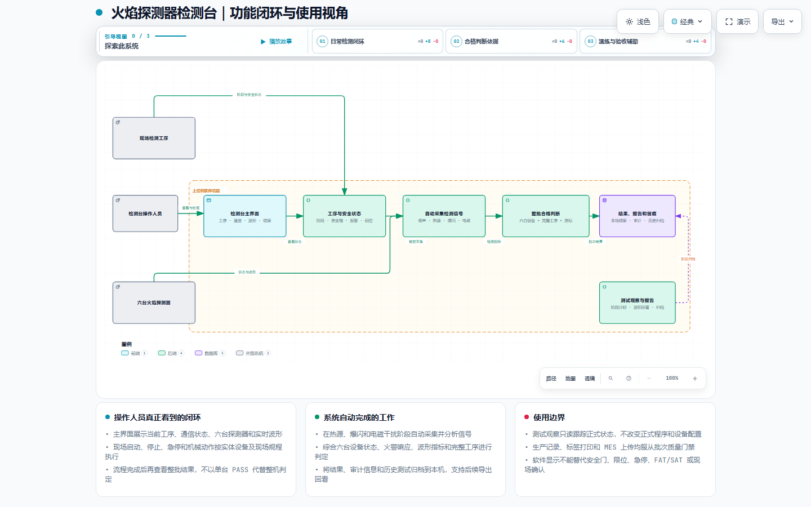

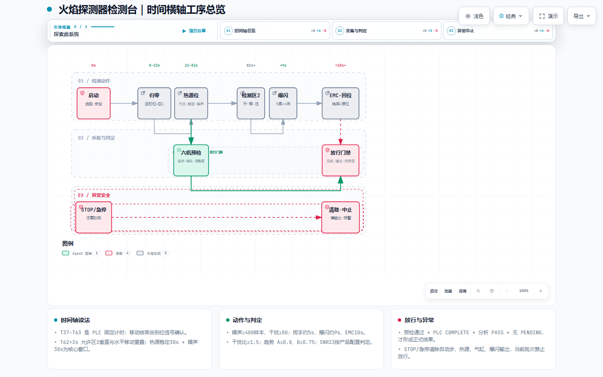

### 2.7 术语说明

| 术语 | 中文含义 |
|---|---|
| PLC | 可编程逻辑控制器 |
| HMI | 人机界面 |
| DI / DO | 数字量输入 / 数字量输出 |
| FAT / SAT | 工厂验收 / 现场验收 |
| ROI | 感兴趣区域 |
| UVC | 通用摄像头接口 |
| HSV | 色调—饱和度—明度颜色模型 |
| MQTT | 消息传输协议 |
| WebSocket | 全双工实时通信协议 |


## 3. 总体技术实现路径与系统架构

### 3.1 分层组成

| 层级 | 主要组成 | 主要职责 |
|---|---|---|
| 机械结构与工装层 | 六槽位工装、水平移动机构、垂直升降机构、气缸/热源机构、爆闪组件、电磁干扰组件、防护结构 | 保证产品定位、动作路径和干扰条件可重复 |
| 检测台电气层 | AC 220 V 配电、DC 24 V 控制电源、SR20 PLC、7 寸 HMI、ZS-DI-16、串口服务器、交换机、电机驱动、继电器/接触器、限位传感器 | 完成供电、动作驱动、位置反馈、安全链、继电器触点采集和现场网络汇聚 |
| PLC 与人机界面控制层 | S7-200 SMART SR20、MicroWIN SMART 工程、7 寸 MCGS HMI | 执行顺序控制、安全联锁、动作输出、步序显示和人工启停 |
| 设备通信层 | S7 过程监测、多路 RS485 串口服务器、六路 TCP 数据通道、ZS-DI-16 网络 DI、UVC 摄像头 | 获取 PLC 工序、六台探测器波形/状态、火警/故障继电器物理反馈和视觉图像 |
| 上位机服务端 | Node.js、Express、WebSocket、现场状态服务 | 状态汇总、波形分析、质量判定、审计、记录、标签和外部接口 |
| 上位机界面应用 | React 19、TypeScript、Vite | 实时主屏、详情配置、波形、报警、结果和操作反馈 |
| 桌面部署层 | 触摸屏工控一体机 + Electron 运行环境 | 现场触摸操作、本地服务运行、进程管理、诊断日志和运行配置隔离 |
| 生产数据层 | JSON 配置、JSONL 审计、生产记录、标签队列、测试归档 | 保存配置、过程证据、结果报告和异常追溯 |

### 3.2 整体技术实现路线

本项目采用“**先把人工检测工艺标准化，再将动作交给 PLC，将数据交给上位机，将结果接入生产追溯**”的实现路线。工程上不是先开发界面再寻找现场信号，而是从产品质量项目反向拆解到机械动作、I/O、通信数据和软件判定。


实现过程中的关键原则为：

- **物理动作可重复**：同一产品每次处于相同位置、相同动作路径和相同干扰条件；
- **控制路径确定**：PLC 负责动作状态机和安全联锁，避免上位机网络延迟影响危险动作；
- **数据与工序同步**：上位机根据 PLC 阶段码打开对应采样窗口，确保“采到什么数据”能够对应“当时做了什么动作”；
- **判定来源统一**：产品型号、软件版本、探头数、波形阈值和继电器规则由配置统一管理；
- **结果必须闭环**：检测完成不等于生产闭环，只有报告、标签、MES 和人工贴标确认完成后，批次才具备完整追溯证据。

### 3.3 机械结构搭建

#### 3.3.1 总体布局

检测台采用面向六台火焰探测器并行检测的固定工装结构，核心由六槽位产品工装、水平丝杆模组、垂直丝杆升降模组、热源摆动机构、LED 强光频闪机构以及电磁干扰机构组成。结构设计重点不是追求复杂的多轴插补，而是通过固定位置、固定行程、到位反馈和 PLC 固化节拍，使每批产品接受一致的检测条件。

结构实现如下：

1. **六槽位上料/检测工装**：一次固定六只火焰探测器，槽位 D1～D6 与通信端口、视觉 ROI、波形数据和生产记录一一对应。
2. **水平运动机构**：采用伺服可编程电机配合丝杆模组，在初始位、热源检测位置和频闪/干扰位置之间移动。PLC 不直接进行脉冲位置控制，而是通过继电器输出开关量连接伺服驱动器，由开关量触发驱动器内部预先固化的定位控制程序。
3. **垂直升降机构**：采用伺服电机配合丝杆模组，整体带动六槽位探针/压针组件统一上升、下降。到达检测位 1 或检测位 2 后，垂直机构下降，使 6 组探针同时压合 6 只产品，从而建立 DC 24 V 供电、RS485 通信及火警/故障继电器触点采集连接；测试完成后垂直机构上升，探针整体脱离。PLC 通过继电器开关量触发伺服驱动器内部预置程序，上、下限位参与动作完成和安全保护。
4. **热源摆动机构**：模拟热源为带加热丝的金属棒，由气缸驱动进行往复摆动；电磁阀采用 DC 24 V 控制。当前摆动测试节拍约为 2 s 往返 × 3 次，由 PLC 固化动作时序。
5. **LED 强光频闪机构**：采用固定安装的 LED 强光灯，由 PLC 继电器输出控制频闪动作，在规定工序内形成重复的强光干扰条件。
6. **电磁干扰机构**：现场采用对讲机作为电磁干扰源，由 PLC 自动控制其进入规定的发射/干扰状态，减少人工按键导致的时长和触发时刻差异。
7. **线缆与通信组织**：六台产品采用固定供电和通信接口；运动机构线缆预留拖链或柔性弯曲空间，动力线、控制线和通信/采样线分开布置。

#### 3.3.2 运动控制实现特点

本设备的水平、垂直伺服并非由 PLC 直接输出高速脉冲完成位置闭环，而采用“**PLC 顺序控制 + 继电器开关量触发 + 伺服驱动器内部预置程序**”的工程实现方式：

```text
PLC 工序状态机
    ↓
PLC DO 输出
    ↓
中间继电器
    ↓
伺服驱动器开关量输入
    ↓
调用驱动器内部固定定位/运行程序
    ↓
丝杆模组执行水平或垂直运动
    ↓
位置/限位传感器反馈 PLC
    ↓
PLC 确认到位后进入下一工序
```

该方式将现场运动参数固化在驱动器内部，PLC 主要负责“什么时候动作、调用哪个动作、是否已经到位以及异常时是否停止”，有利于降低 PLC 程序复杂度，同时保持现场调试和维护边界清晰。

#### 3.3.3 结构设计要点

| 结构项目 | 当前实现 | 技术目的 |
|---|---|---|
| 六槽位定位 | D1～D6 固定槽位和固定基准 | 保证产品编号、通信端口、视觉区域和检验结果对应 |
| 水平机构 | 伺服可编程电机 + 丝杆模组 | 保证初始位、热源位、频闪/干扰位重复定位 |
| 垂直机构 | 伺服电机 + 丝杆模组 + 上下限位，统一带动六槽位探针组件 | 在检测位 1/2 同步压合六只产品，并保证升降位置一致及避免过行程 |
| 伺服控制 | PLC 继电器开关量触发驱动器内部固定程序 | 减少复杂脉冲控制，提高现场调试可维护性 |
| 热源机构 | 带加热丝金属棒 + 气缸摆动 | 形成重复的模拟热源刺激 |
| 摆动节拍 | 约 2 s 往返 × 3 次 | 将人工摆动动作标准化 |
| 强光干扰 | LED 强光灯 + PLC 继电器频闪控制 | 保证各批次光干扰条件一致 |
| 电磁干扰 | 对讲机 + PLC 自动控制 | 固定干扰时机和持续时间 |
| 防护与维护 | 急停、双手启动、安全链及运动区域防护 | 降低误动作和夹伤风险 |

机械结构与电气控制采用“**到位反馈优先、时间超时兜底**”的原则。垂直机构完成条件以已经安装的上、下限位为主要依据，定时器主要承担超时保护和工序冗余，不作为唯一位置判断依据。

### 3.4 电气架构与选型

#### 3.4.1 已确认核心电气配置

检测台现场采用 AC 220 V 作为整机输入电源，PLC、传感器、继电器、电磁阀等控制回路采用 DC 24 V。控制核心为 **Siemens S7-200 SMART SR20**，现场配置 **7 寸 MCGS（昆仑通态）HMI**；同时配置一台**带触摸屏的工控一体机**运行上位机软件。两块屏职责分离：7 寸 HMI 面向 PLC 现场启停、报警与维护，工控一体机面向检测数据、波形、视觉、判定、记录和追溯。数据采集侧由多路 RS485 串口服务器、以太网交换机和 **ZS-DI-16（RJ45）** 数字量采集模块共同组成。

| 电气类别 | 已确认方案 | 主要职责/接口 |
|---|---|---|
| PLC | **Siemens S7-200 SMART SR20** | 自动工序、动作联锁、限位、安全链、频闪、热源及 EMC 控制 |
| HMI | **7 寸 MCGS（昆仑通态）HMI** | PLC 现场启停、状态、报警、工序和维护操作 |
| 上位机 | **触摸屏工控一体机** | 与 7 寸 HMI 独立存在；运行 Electron + Node.js，完成六台数据采集、波形、视觉、判定、记录、标签及 MES 追溯 |
| 串口服务器 | **1 台多路 RS485 → TCP 串口服务器** | 统一承载 D1～D6 多组 485 通道并行转换，并以独立 TCP 端口经交换机传输至工控一体机 |
| 网络交换 | **以太网交换机** | 汇聚串口服务器等现场网络设备与工控一体机之间的数据链路 |
| 继电器 DI 采集 | **ZS-DI-16（RJ45）** | 专项采集六只火焰探测器的火警、故障继电器开关量输出，形成独立实体触点证据 |
| 水平驱动 | 伺服可编程电机 + 伺服驱动器 | 继电器开关量触发驱动器内部固定定位程序，驱动水平丝杆模组 |
| 垂直驱动 | 伺服电机 + 伺服驱动器 | 继电器开关量触发固定升降程序，驱动垂直丝杆模组 |
| 位置/限位检测 | 初始位、工位及上下限位传感器 | 到位确认、工序切换、超程保护 |
| 探针工装 | 六槽位压针/探针组件 | 垂直机构统一下压后，同时建立 6 只产品的 DC 24 V 供电、RS485 通信以及火警/故障继电器触点连接 |
| 热源 | 带加热丝金属棒 | 固定位置形成模拟热源刺激 |
| 气动执行 | 气缸 + DC 24 V 电磁阀 | 驱动加热丝金属棒往复摆动 |
| 强光干扰 | LED 强光灯 | PLC 继电器输出控制频闪 |
| 电磁干扰 | 对讲机 | 由 PLC 自动控制形成规定时长的电磁干扰 |
| 视觉设备 | UVC USB 摄像头 | 单摄像头覆盖 D1～D6，由软件划分六个 ROI 进行指示灯状态取证 |
| 控制/产品电源 | **3 组 DC 24 V 开关电源** | 为控制回路及六只被测产品提供分组 24 V 供电，具体槽位分组以现场接线为准 |
| 整机输入 | **AC 220 V** | 为驱动器、电源、加热及其他负载提供输入电源 |
| 安全回路 | **急停 + 双手启动 + 安全继电器 + 主接触器** | 危险动作许可、紧急停机和主动力切断 |
| 配电保护 | 断路器、支路保护、PE 接地、端子排 | 动力/控制分区保护和检修隔离 |

> 说明：水平/垂直伺服电机及驱动器的具体品牌、订货型号当前未确认，本报告不虚构型号；最终可在设备铭牌、采购 BOM 或电气图纸确认后补录。

#### 3.4.2 六台产品供电与数据采集拓扑

六只被测火焰探测器固定在 D1～D6 槽位后，并不是全程持续通过探针接入。检测台移动至**检测位 1 或检测位 2**后，垂直伺服带动整套六槽位探针组件统一下降，6 组探针同时与 6 只产品测试点接触，并建立 DC 24 V 供电、RS485 通信以及火警/故障继电器触点连接；测试完成后垂直机构上升，探针统一脱离。六只产品由 **3 组 DC 24 V 开关电源**分组供电，具体槽位分配以现场接线为准。

火焰探测器数据链路采用“**多组 RS485 并行采集 → 串口服务器转 TCP → 交换机汇聚 → 工控一体机处理**”的结构：

~~~text
D1～D6 火焰探测器
        ↓
六槽位探针/压针工装
（检测位 1/2 下压后接通 DC 24 V + RS485 + 继电器触点）
        ↓
多组独立 RS485 通道
        ↓
1 台多路串口服务器
（RS485 → TCP）
        ↓
以太网交换机
        ↓
触摸屏工控一体机
        ↓
Node.js 设备通信服务
        ↓
六台并行波形/状态采集与质量分析
~~~

当前软件配置与该结构对应：六台设备均连接到串口服务器地址 192.168.16.253，分别通过 31001 / 32001 / 33001 / 34001 / 35001 / 36001 TCP 端口建立独立数据通道；串口侧参数为 115200、8N1。这样可以在同一检测阶段同时采集六台产品的状态和多探头波形，避免共用单通道轮询造成的数据拥塞和时序混淆。

#### 3.4.3 火警/故障继电器实体反馈采集

火警、故障继电器反馈不与波形 RS485 数据共用同一采集链路，而由 **ZS-DI-16（RJ45）** 专项采集开关量信号。每只产品分别提供火警、故障两路实体触点，共形成 12 路主要判定信号。上述触点同样由六槽位探针/压针工装引出：探针下压后，同时建立产品供电、RS485 与继电器触点采集连接。

当前软件配置中，继电器反馈采集模块使用网络地址 192.168.0.7:8234，共配置 16 路输入；D1～D6 的火警/故障触点依次映射到 X1～X12。软件在继电器功能测试阶段持续读取这些物理输入，并通过稳定采样、极性规则和超时规则判断触点是否真正动作。

该设计使“探测器协议上报的状态”和“产品实体继电器是否实际翻转”成为两条独立证据链，可避免只依赖软件状态而遗漏继电器硬件异常。

#### 3.4.4 伺服驱动控制链

水平和垂直机构采用相同的基本控制思路：

~~~text
S7-200 SMART SR20
        ↓ DO
   中间继电器
        ↓ 开关量
  伺服驱动器 DI
        ↓
驱动器内部预置程序
        ↓
     伺服电机
        ↓
      丝杆模组
        ↓
位置/上下限位反馈
        ↓
PLC 判断动作完成/异常
~~~

因此，PLC 程序中的运行、暂停、方向或动作选择信号，本质上属于对驱动器预置动作的离散触发信号，而不是 PLC 自身执行完整位置环控制。报告后续涉及运动控制时统一按该真实实现描述。

#### 3.4.5 供配电与安全链

现场已经配置 AC 220 V 整机输入和 DC 24 V 控制电源，并安装急停、双手启动、安全继电器、主接触器及垂直上下限位。电气系统按以下思路组织：

- **AC 220 V 动力侧**：为伺服驱动器、工业电源、加热/强光等负载提供电源，经断路器和支路保护后分配；
- **DC 24 V 控制与产品供电侧**：现场采用 3 组开关电源，为 PLC、传感器、中间继电器、电磁阀及六只被测产品提供分组供电；
- **被测产品供电**：六只产品由 3 组 DC 24 V 开关电源分组供电，通过检测位 1、2 的探针统一下压建立连接，使供电动作与检测位置形成固定对应关系；
- **安全链**：急停、双手启动、安全继电器和主接触器共同形成危险动作许可和动力切断链路，安全功能不依赖上位机网络状态；
- **伺服接口**：PLC DO 不直接驱动电机，而经中间继电器隔离后接入伺服驱动器 DI；
- **高负载隔离**：加热丝、LED 强光灯及其他较大负载均通过继电器/接触器或适配开关器件控制，避免 PLC 输出直接承载功率负载；
- **数据网络**：串口服务器将多路 485 数据转为 TCP，经交换机接入触摸工控一体机；继电器 DI 采集模块通过 RJ45 形成独立网络采集链；
- **信号分区**：动力线、24 V 控制线、RS485、以太网、USB 等通信弱信号线分区布线，必要时采用屏蔽、接地和物理间距降低干扰；
- **接地保护**：机架、金属结构和相关设备可靠接 PE，伺服、加热及电磁干扰源与通信采样回路重点做好抗干扰处理；
- **限位保护**：垂直上下限位已经安装并参与 PLC 工序判断，动作超时与限位反馈共同构成异常停止条件。

#### 3.4.6 电气设计原则

本检测台电气设计形成“**安全链独立、PLC 顺控、继电器隔离、串口服务器并行采集、网络 DI 独立取证、工控一体机集中分析**”的总体结构。危险动作由 PLC/硬件层负责；火焰探测器波形、继电器触点和视觉图像分别通过独立采集链进入上位机，最终在同一批次上下文中完成质量判定。

### 3.5 PLC/HMI 控制实现

PLC 将检测流程实现为受控状态机，使用 `M10.x/M11.x/M13.x/M14.x` 等步骤位组织动作，使用 `VW600/VW602` 对外发布工序和子步骤。PLC 的主要职责包括：

1. 上电和启动条件检查；
2. 水平、垂直机构回零和位置确认；
3. 热源、爆闪、EMC 等阶段动作；
4. 限位、急停、安全链和动作超时；
5. 输出互锁和 STOP 后的安全收敛；
6. 向 HMI 和上位机发布当前工序状态。

HMI 只承担现场操作和状态显示：正常生产提供开始、停止、报警和工序状态；维护页面通过受控中介变量进行查线和调试，不能直接绕过安全链写物理输出。

### 3.6 上位机软件设计

上位机采用前后端分层和桌面化部署：

- **界面层**：React 19 + TypeScript + Vite，负责工序、六台探测器、波形、视觉、报警和结果展示；
- **服务层**：Node.js + Express + WebSocket，负责 PLC/探测器状态聚合、业务 API、实时推送和运行协调；
- **设备适配层**：S7 只读过程监测、多路 RS485 串口服务器 TCP 通道、ZS-DI-16 网络 DI、UVC USB 摄像头；
- **算法层**：产品预检、波形窗口、噪声、干扰比、一致性趋势、P2/P3、继电器和视觉判定；
- **生产服务层**：生产记录、标签队列、MES、MQTT、日志和软件版本管理；
- **桌面宿主层**：Electron 将界面和后端打包为单机可部署应用，现场电脑无需单独搭建 Web 服务器。

软件设计强调“控制权与判定权分离”：正式现场模式不通过上位机直接写 PLC Q/M 输出，上位机以 PLC 工序状态为时间基准采样和判定。这样即使上位机界面刷新、WebSocket 重连或计算任务延迟，也不会改变 PLC 正在执行的安全动作。

### 3.7 数据同步与质量判定路径

检测过程中的数据流按以下顺序形成：

1. PLC 进入某一工序并发布 `VW600/VW602` 和关键状态位；
2. 上位机过程监测服务识别阶段并打开对应分析窗口；
3. 检测位 1/2 探针下压后，六台探测器通过多组 RS485 接入串口服务器，由六个独立 TCP 通道并行上传多通道 RAW/归一化波形；
4. 产品感知服务结合型号读取软件版本、探头数、灵敏度和继电器配置；
5. 波形分析器计算噪声、绝对值、干扰比、一致性趋势和探头比值；
6. 单个 UVC 摄像头按 D1～D6 六个 ROI 形成指示灯视觉证据；ZS-DI-16 独立采集六只产品的火警/故障继电器实体触点；
7. 最终判定服务只有在 PLC 完成、六台数据完整、所有必需证据有效时才生成批次结论；
8. 生产协调器将结果写入检验记录，并触发标签、MES 和后续人工贴标确认。

这种路径将“机械动作—采样窗口—算法结果—生产记录”绑定到同一批次上下文，解决人工检测中动作和记录容易脱节的问题。

### 3.8 工程实施与验证路径

| 阶段 | 主要工作 | 关键输出 |
|---|---|---|
| 1. 需求与工艺梳理 | 将人工检验项目、质量问题和判定标准拆解为可执行步骤 | 工序清单、判定项目、节拍草案 |
| 2. 结构方案 | 六槽位、运动路径、干扰源位置、上/下料和维护空间设计 | 结构布局、动作顺序、传感器位置 |
| 3. 电气设计 | PLC/HMI、驱动、传感器、继电器、DIO、电源和配电规划 | I/O 表、电气原理、端子/接线和器件清单 |
| 4. PLC/HMI 开发 | 状态机、联锁、定时、报警、工序显示和维护功能 | PLC/HMI 工程、工序码和现场操作界面 |
| 5. 通信接入 | S7、六台探测器、DIO、摄像头和外部接口 | 通信配置、协议适配和设备状态模型 |
| 6. 上位机与算法 | 波形、预检、视觉、继电器、最终门禁和异常分类 | 现场程序、质量算法和配置模型 |
| 7. 生产闭环 | 报告、标签、MES、版本和日志 | 可追溯的生产记录链 |
| 8. FAT/SAT | I/O 逐点、动作、安全、六台重复性、异常和恢复测试 | FAT/SAT 记录、版本/CRC/哈希、问题闭环 |
| 9. 量产优化 | 根据真实日志和批次结果调整稳定等待、阈值、界面和诊断 | 稳定节拍、异常分类和持续改进版本 |

### 3.9 逻辑架构

~~~mermaid
flowchart LR
    OP[操作人员] --> IPC[触摸屏工控一体机<br/>React + Electron]

    subgraph FIELD[检测台现场]
        PLC[SR20 PLC / 7寸 MCGS HMI<br/>顺序控制与安全联锁]
        ACT[伺服、气缸、热源、LED强光、对讲机]
        POS[位置、限位、安全 DI]
        PROBE[六槽位探针工装<br/>垂直伺服统一下压]
        D[D1-D6 火焰探测器]
        SS[多路串口服务器<br/>RS485 → TCP]
        DIO[ZS-DI-16 RJ45<br/>火警/故障触点]
        CAM[UVC USB 摄像头<br/>单相机六 ROI]
        SW[以太网交换机]
    end

    PLC --> ACT
    POS --> PLC
    PLC -->|S7 只读状态| SW

    D --> PROBE
    PROBE -->|多组 RS485| SS
    SS -->|六路 TCP 31001~36001| SW

    PROBE -->|火警/故障继电器触点| DIO
    DIO -->|RJ45 网络采集| SW

    CAM -->|USB| IPC
    SW --> IPC

    IPC --> RT[Node.js 统一现场服务]
    RT --> MON[PLC Process Monitor]
    RT --> DET[六台探测器并行采集]
    RT --> RELAY[继电器实体反馈测试]
    RT --> ANA[波形 / 视觉 / 质量判定]
    ANA --> REC[生产记录 / 审计 / 标签队列]
    REC --> PRN[标签机自动打印]
    REC --> MES[MES 自动上传]
    REC --> EXT[状态上报 / 诊断上传]

    OBS[只读测试观察器] -.HTTP/WS.-> RT
~~~

该架构将三类质量证据物理分离：**探测器波形/状态走 RS485→串口服务器→TCP，火警/故障实体触点走 ZS-DI-16，指示灯状态走 USB 摄像头**；三类数据最终在工控一体机中与 PLC 工序状态进行时间关联并形成批次结果。

### 3.10 运行模式与端口

| 模式 | 界面应用 | 服务端 | 说明 |
|---|---:|---:|---|
| 现场开发 | `127.0.0.1:3002` | `127.0.0.1:3001` | 读取 PLC 与探测器状态，现场页面保持只读监测 |
| 单文件桌面版 | 内置浏览器内核 | `127.0.0.1:3003` | Electron 内置服务端和界面应用，运行数据复制到用户应用数据目录 |
| 测试观察器 | `127.0.0.1:3005` | `127.0.0.1:3004` | 只读观察正式程序，不打开 PLC/探测器会话、不发送控制命令 |

现场界面通过 WebSocket 接收 `plc_process_status`、`flame_state`、`flame_waveform_delta` 和 `field_summary`；HTTP 用于首次快照、配置读取和需确认的业务操作。WebSocket 断线后自动重连，并以 HTTP 轮询作为备用状态通道。


## 4. 工序流程设计

### 4.1 主流程

检测台实际工艺按“**上料建档 → PLC 初始化 → 检测位 1 综合功能检测 → 检测位 2 抗干扰检测 → 回初始位 → 综合判定与生产闭环**”执行。产品预检、继电器功能验证和指示灯视觉识别均在检测位 1 探针压合并建立供电/通信后完成，而不是在机械工序开始前独立执行。

~~~mermaid
flowchart TD
    A1[01 设备准备<br/>上电、安全、限位、通信] --> A2[02 产品与批次建档<br/>型号、产品编号、D1-D6槽位]
    A2 --> I[03 PLC初始化与回零<br/>垂直上限位 + 水平初始位]

    I --> P1[04 移动至检测位1]
    P1 --> P1D[05 垂直下降<br/>六槽位探针统一压合]
    P1D --> LINK[06 接通DC24V + 六路RS485<br/>+ 火警/故障继电器触点]
    LINK --> STABLE[07 等待设备稳定与通信建立]
    STABLE --> PRE[08 产品预检<br/>软件版本、探头数、灵敏度、通信状态]
    PRE --> REL[09 继电器功能验证<br/>模拟火警/故障指令 + ZS-DI-16实体触点]
    REL --> VIS[10 指示灯视觉识别<br/>运行/火警/故障灯态取证]
    VIS --> NOISE[11 基础噪声采集与A/B分级]
    NOISE --> HEAT[12 加热丝金属棒摆动<br/>热源响应/趋势/探头比值]
    HEAT --> P1U[13 垂直上升<br/>探针脱离]

    P1U --> P2[14 移动至检测位2]
    P2 --> P2D[15 垂直下降<br/>六槽位探针再次压合]
    P2D --> FLASH[16 LED强光频闪<br/>抗强光干扰检测]
    FLASH --> EMC[17 PLC自动控制对讲机<br/>电磁干扰检测]
    EMC --> P2U[18 垂直上升<br/>探针脱离]
    P2U --> HOME[19 回初始位并确认]
    HOME --> COMPLETE[20 PLC工序完成]

    COMPLETE --> Q[21 六台综合判定<br/>工序+通信+波形+继电器+视觉]
    Q --> R[22 自动生成检验报告]
    R --> L[23 生成并打印标签]
    R --> MES[24 MES自动上传]
    L --> H[25 人工核对并贴标]
    MES --> H
    H --> C[26 生产追溯闭环]

    Q -.不合格/需复测.-> N[异常报告与产品隔离]
    I -.STOP/急停/超时.-> S[停止输出并中止本批次]
    P1 -.-> S
    P2 -.-> S
~~~

其中，火警功能**不采用真实点火方式**。检测位 1 通过上位机向产品发送模拟火警/故障等功能指令，再分别核对通信状态、ZS-DI-16 实体继电器触点以及摄像头识别到的对应指示灯状态，从而验证完整功能链路，同时避免在自动检测台内引入明火。

### 4.2 完整生产工序步骤

| 序号 | 工序步骤 | 执行主体 | 主要输入/动作 | 输出和闭环结果 |
|---:|---|---|---|---|
| 1 | 设备准备 | 操作员、PLC、上位机 | 设备上电、安全链、限位、PLC/网络状态 | 确认检测台处于可启动状态 |
| 2 | 产品与批次建档 | 上位机 | 产品型号、批次号、产品编号、D1-D6 槽位 | 建立批次和槽位对应关系 |
| 3 | 初始化与回零 | PLC/HMI | 启动请求、安全条件、上下限位、初始位 | 垂直复位、水平回初始位 |
| 4 | 移动至检测位 1 | PLC、伺服机构 | 水平预置程序、位置 1 到位反馈 | 检测台到达综合功能检测位置 |
| 5 | 探针压合与设备上电 | PLC、垂直机构、探针工装 | 垂直下降、下限位、3 组 DC24V 电源 | 六台产品同时建立供电、RS485 和继电器触点连接 |
| 6 | 产品预检 | 上位机、探测器服务 | 六路 TCP 通信、软件版本、探头数、灵敏度、设备状态 | 形成 D1-D6 预检记录 |
| 7 | 继电器功能验证 | 上位机、探测器、ZS-DI-16 | 模拟火警/故障功能指令、实体触点反馈 | 验证火警/故障继电器实际动作和复位 |
| 8 | 指示灯视觉识别 | UVC 摄像头、上位机 | 运行、模拟火警、模拟故障阶段图像 | 形成 D1-D6 指示灯视觉证据 |
| 9 | 基础噪声检测 | 探测器服务、波形分析 | 稳定窗口内多探头 RAW 数据 | 按 A 类正式限值及 B 类试运行限值进行筛选 |
| 10 | 热源/摆动检测 | PLC、气缸、加热丝金属棒、探测器服务 | 约 2 s 往返 × 3 次、波形同步采集 | 验证热源响应、多探头变化趋势和探头比值 |
| 11 | 检测位 1 结束 | PLC、垂直机构 | 垂直上升、上限位 | 探针脱离，允许水平移动 |
| 12 | 移动至检测位 2 | PLC、伺服机构 | 水平预置程序、位置 2 到位反馈 | 到达抗干扰检测位置 |
| 13 | 探针再次压合 | PLC、垂直机构、探针工装 | 垂直下降、下限位 | 六台产品重新建立供电和通信连接 |
| 14 | LED 强光频闪 | PLC、LED 强光灯、探测器服务 | PLC 继电器输出控制频闪 | 验证强光下无误报、通信稳定及波形/比值满足要求 |
| 15 | 电磁干扰 | PLC、对讲机、探测器服务 | PLC 自动控制对讲机进入规定干扰状态 | 验证 EMI 下无误报、通信稳定及波形/比值满足要求 |
| 16 | 检测位 2 结束并回位 | PLC、垂直/水平机构 | 探针上升、水平回初始位 | 完成机械回位，未回位不得放行 |
| 17 | 六台综合判定 | 上位机服务端 | PLC 完成、预检、波形、继电器、视觉及抗干扰结果 | 形成 A 类、B 类试运行筛选、不合格或需复测结果 |
| 18 | 检验报告生成 | 上位机服务端 | 批次号、产品号、检测数据和判定 | 自动生成生产检验记录 |
| 19 | 标签打印与 MES 上传 | 标签/MES 服务 | 产品编号、二维码、结论、报告文件 | 自动打印并上传；失败进入队列重试 |
| 20 | 人工贴标确认 | 操作员 | 标签、产品编号、报告和 MES 状态 | 核对后贴标，完成生产追溯闭环 |

当前生产基准以 **A 类产品规则**为正式检验标准。B 类规则用于试运行阶段的边界样本筛选和数据积累，不应在报告中表述为已经冻结的长期质量规范。

### 4.3 工序阶段与状态码

受控上位机契约通过 `VW600` 和 `VW602` 读取 PLC 工序：

| 阶段 | `VW600` | `VW602` | PLC 主要步骤 | 主要动作与判定意义 |
|---|---:|---:|---|---|
| `INIT` 初始化 | 1 | 1 | `M10.0`、`M10.1`、停顿步 `M14.0`、`M14.1` | 垂直复位、水平回初始位，确认检测台起始姿态 |
| `HEAT` 移动热源 | 2 | 2/3 | `M10.2`、`M10.3`、`M13.0~M13.4`、`M10.5` | 到热源位、下压、热源触发、上行复位；采集稳定、噪声和热源干扰数据 |
| `FLASH` 爆闪干扰 | 3 | 3 | `M10.6`、`M10.7`、`M11.0` | 到爆闪位、下压、爆闪触发，采集爆闪抗干扰数据 |
| `EMC` 电磁干扰 | 4 | 3 | `M11.2` | PLC 安全门控后输出电磁干扰，采集 EMC 数据 |
| `RETURN_HOME` 回初始位 | 通常回到 1 | 1 | `M11.4` + `M10.0/M10.1` | EMC 完成后不能直接放行，必须重新执行并确认回初始位 |
| `COMPLETE` 完成 | 0 | 0 | `M0.1` | 输出清除、运行结束，整批结果才进入最终判定阶段 |

`M11.4` 是回初始位的关键标志。由于回位过程中 `VW600/VW602` 可能暂时回到初始化或热源相关数值，上位机使用 `M11.4` 识别 `RETURN_HOME`，防止 EMC 后的状态抖动重新打开热源分析或提前生成报告。

### 4.4 各阶段动作说明

#### 4.4.1 初始化

1. M10.0 启动垂直上行，方向 Q1.1=1，垂直电机电源 Q0.4=1。
2. 通过 I0.3 上限位确认垂直机构及六槽位探针组件处于安全上位。
3. 进入停顿步，保持水平电机停止/暂停优先状态。
4. M10.1 驱动水平机构回初始位置，直到 I0.0 到位。
5. 初始化完成后清理旧工序状态，开始向检测位 1 移动。

#### 4.4.2 检测位 1：综合功能与热源检测

1. 水平机构移动至检测位 1，并通过 I0.2 确认到位。
2. 垂直伺服带动六槽位探针组件整体下降，以 I0.4 下限位确认压合位置。
3. 探针压合后，六只产品同时接通 DC 24 V 供电、多组 RS485 通信以及火警/故障继电器触点采集线路。
4. 上位机等待通信和波形稳定后，对 D1～D6 执行软件版本、探头数、灵敏度、通信状态等产品预检。
5. 对需要进行继电器功能检测的产品，通过通信协议发送**模拟火警、模拟故障及复位指令**；ZS-DI-16 同步读取火警/故障实体继电器触点，验证产品实际输出是否随指令正确动作。
6. 单个 UVC 摄像头覆盖 D1～D6，在运行、模拟火警、模拟故障阶段按六个 ROI 采集指示灯图像，形成绿灯、红灯、黄灯等视觉证据。
7. 产品进入稳定状态后，上位机开启基础噪声采样窗口；当前正式生产首先按 A 类指标判断，同时保留 B 类试运行筛选结果。
8. 热源阶段由 PLC 控制带加热丝金属棒和气缸执行约 2 s 往返 × 3 次的摆动刺激，上位机同步采集波形，分析热源响应、多个探头变化趋势及探头比值。
9. 检测位 1 项目完成后，垂直机构上升至 I0.3，探针与产品脱离，再允许水平机构向检测位 2 移动。

检测位 1 是本设备的**综合功能检测位**，承担产品基础配置核验、继电器/指示灯功能验证、基础信号质量和热源响应检测。设备不在该位置使用酒精灯或其他真实明火。

#### 4.4.3 检测位 2：LED 强光频闪

1. 水平机构移动至检测位 2，并通过 I0.1 确认到位。
2. 垂直机构下降，六槽位探针组件重新压合六只产品，使产品重新获得 DC 24 V 供电与 RS485 通信。
3. PLC 通过继电器输出控制固定安装的 LED 强光灯按照既定节拍频闪。
4. 上位机在频闪阶段持续采集六台产品波形、通信和报警状态。
5. 判定重点包括：**不能产生误火警、通信不能异常掉线、波形不能异常失控、探头比值/干扰比满足当前产品阈值**。
6. 频闪完成后继续保持检测位 2 的产品连接，进入电磁干扰阶段。

#### 4.4.4 检测位 2：电磁干扰与回位

1. PLC 自动控制对讲机进入规定的发射/干扰状态，不依赖操作员手动持续按键。
2. 上位机持续观察六台产品的火警/故障状态、通信连续性和多探头波形。
3. 判定重点与强光频闪一致：产品不得因干扰产生误火警，通信应保持正常，波形和探头比值/干扰比不得超出当前规则。
4. EMC 阶段完成后，垂直机构上升使探针脱离。
5. PLC 驱动水平机构回初始位，并通过回位状态及位置反馈确认机械机构已经退出检测区域。
6. 只有回初始位完成且 PLC 进入 COMPLETE 后，正式批次结果才允许进入最终判定与生产闭环。

### 4.5 STOP、急停和异常分支

- HMI “结束/中止”写入 `M2.0`；PLC 通过 `M1.0` 锁存停止请求，清除自动步骤、动作位、灯位和输出。
- `I1.0` 是安全/急停输入；断开后 `M0.3` 安全状态失效，流程报警 `M0.2` 置位，输出被清除，水平暂停 `Q0.6` 优先保持。
- `M2.2` 是安全限位状态，受控上位机和 HMI 只能显示，不能由操作员写入或旁路。
- STOP 或急停会使当前批次进入不可放行状态；不能通过刷新界面、重新连接或局部注入数据恢复为合格。
- 安全条件恢复后是否允许重新启动，应以新批次重新初始化为原则；不能直接复用中止批次的部分检测结果。

### 4.6 自动报告、标签、MES 与人工贴标闭环

#### 4.6.1 检验报告自动生成

批次达到 `COMPLETE` 后，生产运行协调器归档当前批次，生产记录服务根据以下数据生成检验报告：

- 批次号、产品型号、产品编号和槽位；
- PLC 工序完成状态和异常状态；
- 软件版本、探头数量、灵敏度和继电器反馈；
- 热源、爆闪、电磁干扰波形分析结果；
- D1-D6 指示灯视觉结果和抓拍数量；
- 产品结论、复测原因和操作人员信息。

报告同时生成浏览器可读的 HTML 文档和 Word/WPS 可打开的 `.doc` 文件，作为生产记录、MES 附件和质量追溯资料。

#### 4.6.2 标签任务生成与自动打印

检验报告归档后，系统按 D1-D6 自动生成标签任务。每个任务包含产品编号、二维码内容、产品型号、判定结果、噪声数据和不合格原因。

标签打印流程如下：

1. 标签任务写入本地标签队列；
2. 标签打印服务通过 USB 或 WiFi 连接标签机；
3. 启用自动打印后，打印服务按双列标签版式自动领取任务并打印；
4. 打印成功、失败、阻止和补打状态写回标签队列；
5. 打印失败保留任务并支持重试；产品编号缺失、报告不合格或任务被隔离时，禁止打印合格标签。

#### 4.6.3 MES 自动上传

生产记录归档事件触发 MES 上传任务。上传内容包括：

- 检验报告文件；
- 产品编号、产品型号、批次号和槽位；
- 合格/不合格结果；
- 操作人员、检验结论和异常说明。

MES 上传服务通过报告附件接口上传检验记录，再通过产品记录接口上传每个产品结果。网络不可用、接口异常或凭证失效时，任务写入本地待上传队列，恢复后自动重试。合格与不合格结果均应保留上传记录；不合格产品不得通过上传结果获得放行资格。

#### 4.6.4 人工贴标与闭环确认

自动打印完成后，操作员按产品编号、二维码和槽位逐项核对，将标签贴附至对应产品。贴标完成后，应在生产记录或现场确认栏记录：

- 批次号和产品编号；
- 标签打印状态；
- 人工贴标确认人和确认时间；
- 不合格产品的隔离或复检状态。

生产闭环关系为：

`检测完成 → 结果判定 → 报告生成 → 标签打印 → MES 上传 → 人工贴标确认 → 批次追溯完成`

当前软件已具备报告生成、标签任务、标签打印状态和 MES 待上传队列，人工贴标确认已纳入现场作业记录，形成“打印—核对—贴标—确认”的完整生产闭环；后续如增加界面化贴标确认，仅属于操作体验优化，不影响当前闭环状态。

### 4.7 检验报告样例

以下附图均来源于项目现有生产检验记录，不使用虚构数据。PNG 为原始记录的页面预览，原始文件同时保留在项目目录中。

#### 4.7.1 项目原始合格记录

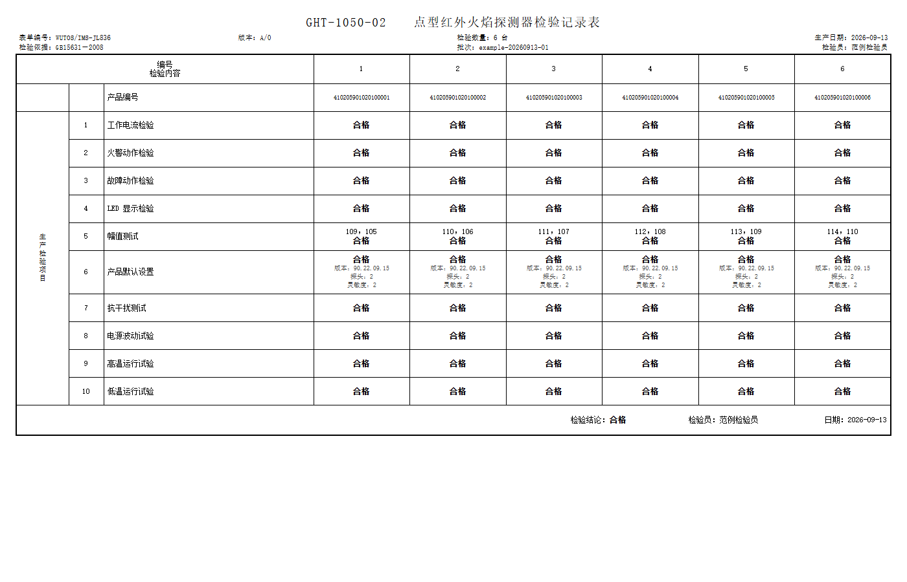

原始文件：[生产检验记录范例-6台-更新版.doc](../examples/生产检验记录范例-6台-更新版.doc)。该记录展示 6 台产品全部合格、指示灯检验、幅值测试、产品默认设置和检验结论。

#### 4.7.2 实际生产不合格记录

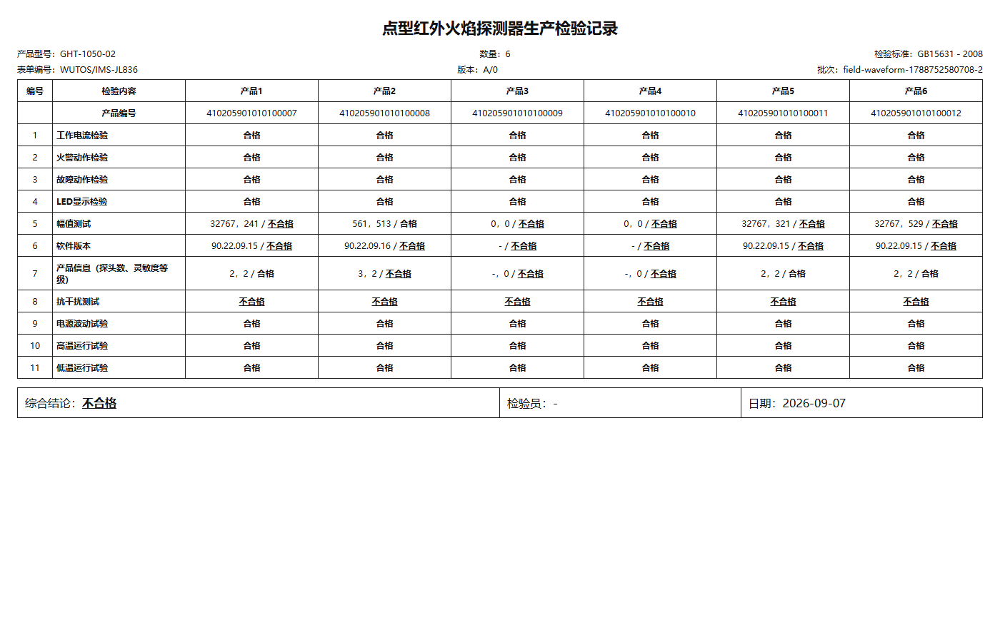

原始文件：[实际生产不合格记录](../production-records/field-waveform-1788752580708-2.html)。该记录包含幅值、软件版本、产品信息和抗干扰项目不合格结论。

不合格批次流程：生成不合格报告、上传不合格结果及报告附件、隔离异常产品，禁止粘贴合格标签；后续进入复检、维修或质量处置流程。

## 5. PLC/HMI 功能开发

### 5.1 PLC 程序结构

PLC 程序以 `OB1` 为主循环，主要由以下网络组成：

1. 安全输入与报警生成：`I1.0 → M0.3`，安全断开或停止请求形成 `M1.0`。
2. 启动上升沿检测：`M2.3` 通过 `M1.5/M1.6` 识别上升沿，并检查安全、报警和运行状态。
3. 步骤状态机：`M10.x`、`M11.x` 保存自动工序步骤；`M13.x` 保存热源脉冲；`M14.x` 保存动作间歇。
4. 定时器：`T37~T43` 用于热源/爆闪节拍，`T44~T47` 用于垂直动作，`T48~T52` 用于工序间停顿和回位，`T62/T63` 用于动作重叠和热源稳定/噪声窗口。
5. 输出判定：自动动作位 `M29.x`、手动中介命令 `M30.x` 经过安全门控后形成 `M31.x`，再驱动物理 `Q` 点。
6. 工序显示：`M21.x` 表示阶段，`M22.x~M23.x` 表示子步骤，`VW600/VW602` 提供 HMI 和上位机读取的阶段/子步骤码。

### 5.2 PLC 点位契约

#### 输入 DI

| 点位 | 语义 | 主要用途 |
|---|---|---|
| `I0.0` | 初始位到位 | 水平回初始位 |
| `I0.1` | 位置 2 到位 | 爆闪位置定位 |
| `I0.2` | 位置 1 到位 | 热源位置定位 |
| `I0.3` | 垂直上限位 | 初始化上行、热源后上行复位 |
| `I0.4` | 垂直下限位 | 热源下行、爆闪下行 |
| `I1.0` | 安全/急停输入 | 安全链和急停判断 |
| `I1.3` | 自动启动输入 | 现场自动启动脉冲，是否启用需与 HMI 版本统一 |

#### 输出 DO

| 点位 | 语义 | 主要用途 |
|---|---|---|
| `Q0.1` | 热源 | 三次模拟热源触发 |
| `Q0.4` | 垂直电机总电源 | 垂直升降允许 |
| `Q0.5` | 水平电机运行 | 水平移动 |
| `Q0.6` | 水平电机暂停 | 未运行、停止、限位或安全异常时优先保持 |
| `Q0.7` | 电磁干扰继电器 | 受控目标版本中由 EMC 自动工序驱动 |
| `Q1.0` | 气缸/挥手测试 | 挥手或气缸动作 |
| `Q1.1` | 垂直方向 | `1=上行`，`0=下行` |
| `Q1.2` | 爆闪灯 1 | 爆闪干扰输出 |
| `Q1.3` | 爆闪灯 2/扩展输出 | 需与现场 HMI、继电器和 EMC 语义最终冻结 |

#### 内部状态与寄存器

| 地址 | 语义 | 上位机/HMI用途 |
|---|---|---|
| `M0.0` | 自动运行 | 运行状态显示和结果生命周期 |
| `M0.1` | 流程完成 | 完成状态与最终门禁 |
| `M0.2` | 流程报警 | 报警、停止和异常提示 |
| `M0.3` | 安全链满足 | 启动门禁和输出安全许可 |
| `M1.0` | 停止/中止锁存 | 原子停止和输出清除 |
| `M2.0` | 停止请求 | HMI 结束/中止命令 |
| `M2.2` | 安全限位 | 只读安全状态 |
| `M2.3` | 启动请求 | HMI 开始上升沿 |
| `M2.4` | 手动使能/旁路 | 目标现场版本应禁止作为安全旁路使用 |
| `M11.4` | 回初始位标志 | 区分 EMC 后回位和普通初始化 |
| `M15.0` | 热源信号稳定 | 上位机分析阶段识别 |
| `M25.2` | 噪声采集窗口 | 上位机噪声分析触发 |
| `VW600` | 当前工序号 | 1/2/3/4/0 对应阶段 |
| `VW602` | 当前子步骤号 | HMI 动画和上位机细分状态 |

### 5.3 输出互锁与安全原则

目标 PLC 逻辑应满足以下原则：

- `Q0.5` 水平运行和 `Q0.6` 水平暂停不能同时有效；水平到位、停止、安全限制时应优先进入暂停。
- 自动工序使用 `M29.x`，手动页使用 `M30.x` 中介命令；自动运行时应隔离手动命令。
- 物理 `Q` 点不能作为 HMI 普通操作按钮的直接写入对象；HMI 只读显示实际输出。
- `M2.2` 安全限位只能由 PLC 安全逻辑生成，HMI 不得提供可写旁路。
- 垂直运动的完成必须由 `I0.3/I0.4` 反馈或经过审查的安全超时策略决定；不能只依赖页面计时。
- 任何安全链断开、限位异常或关键动作超时，都必须停止危险动作、清除输出、置报警并阻止本批次放行。

### 5.4 HMI 页面功能

现有 HMI 静态资产设计为四页：

| 页面 | 主要功能 | 关键变量 |
|---|---|---|
| 工序页 | 阶段高亮、子步骤灯、开始、结束、通信状态和安全状态 | `M21.x`、`M22.x~M23.x`、`M2.3`、`M2.0`、`M0.x`、`VW602` |
| 手动页 | 维护查线、DI/DO 状态、组合动作和全部断开 | `I0.x`、`I1.0`、只读 `Q`、`M30.x`、`M2.2` |
| 报警页 | 流程报警、急停安全报警、安全正常、结束中止 | `M0.2`、`M20.0`、`M0.3`、`M2.0` |
| 配置页 | 预留或计划中的工序参数配置 | `VW690`、`M40.x` 等，是否实际生效需 PLC 支持 |

HMI 的开始按钮应采用“按下置 1、抬起置 0”的脉冲语义；结束按钮同样采用脉冲语义。工序显示变量、手动维护变量和报警变量必须在最终工程中完成读写权限审查。

### 5.5 PLC/HMI 最终版本与上位机契约闭环确认

仓库中的 `PLC.awl`、`config/plc-hmi-upper-contract.json` 和上位机代码用于表达受控目标语义；现场部署以最终 PLC/HMI 工程和验收记录为准。项目已完成最终版本与上位机契约的跨层闭环确认：

| 项目 | 最终闭环状态 | 现场确认结果 |
|---|---|---|
| 垂直限位与超时 | 已闭环 | 垂直上/下动作、限位反馈、异常处置和流程推进已按最终部署版统一，并完成现场验证 |
| 维护/手动权限 | 已闭环 | 维护功能限制在授权调试范围，正常生产流程不得旁路安全链和质量门禁 |
| HMI 物理输出权限 | 已闭环 | 最终 HMI 权限边界已按生产要求收敛，生产操作不直接绕过 PLC 安全联锁 |
| 爆闪节拍 | 已闭环 | 最终工艺节拍已固化，并与上位机采集窗口、质量判定和 HMI 显示保持一致 |
| EMC 输出 | 已闭环 | 实际输出点位、现场接线、PLC/HMI 和上位机语义已统一并完成动作验证 |
| 资产版本与验收资料 | 已闭环 | 最终部署版本、配置、资产基线、I/O 对照及生产/验收资料已完成关联归档 |

以上项目均作为现场交付的一部分完成闭环，不再作为当前项目的未解决风险项。后续若发生 PLC/HMI、接线或工艺参数变更，应重新执行版本关联和变更验证。

## 6. 火焰探测器通信与检测算法

### 6.1 通信协议

项目包含《火焰探测器 Modbus 通信协议》资料，核心参数为：

- RS485 默认 `115200 bps`、`N-8-1`，采用 Modbus RTU；
- 支持功能码 `0x01` 读状态位、`0x03` 读保持寄存器、`0x0F` 写状态位、`0x10` 写保持寄存器；
- 关键寄存器包括灵敏度 `0x0000`、探头数 `0x1000`、发送模式 `0x3000`、实时特征 `0x6000`、通信地址 `0x8000`、火警 `0xB000`、故障 `0xB001` 和系统复位 `0xF000`；
- 支持标准三通道和四波长通道解析，运行时会根据帧特征选择协议配置并维护原始/归一化波形。

现场默认配置为 TCP 网关 `192.168.16.253`，六台探测器端口依次为 `31001/32001/33001/34001/35001/36001`，轮询间隔约 250 ms。每台设备独立保存地址、通信模式、协议类型和波形设置。

### 6.2 探测器启动与预检

探测器服务包含连接、模式切换、帧解析、通道同步和 `TEST_READY` 生命周期。程序会：

1. 建立六台设备的独立连接；
2. 发送并确认连续波形/主动发送模式；
3. 检查帧格式、通道数、地址和数据更新时间；
4. 等待连续有效帧和通道同步，确认设备进入可检测状态；
5. 在检测位 1 探针压合、供电和通信稳定后，并行读取软件版本、探头数、灵敏度、火警和故障状态；
6. 对启用继电器功能测试的产品发送模拟火警/故障功能指令并执行复位，由 ZS-DI-16 读取实体继电器触点，同时由摄像头采集对应指示灯状态；全流程不使用真实明火。

代码和测试覆盖“模式切换未确认不能进入可测试”“有效帧连续性”“六台并行模式命令”“晚到波形恢复”“命令有限重试”等场景。测试链路故障与产品质量失败分开分类，基础设施异常形成“需复测”，不得静默改判为合格。

### 6.3 视觉检测与指示灯视觉取证

#### 6.3.1 当前功能定位

项目已实现面向生产检验的指示灯视觉检测功能，并固定在**检测位 1 的继电器/功能验证阶段**执行：通过单个通用摄像头同时覆盖六个探测器槽位，对发光二极管指示灯（LED）进行图像取证和颜色状态判定。该功能的验收范围为指示灯状态识别与生产证据留存，不包含完整产品外观工业视觉检测。

当前视觉检测对象为：

| 视觉对象 | 当前状态 | 正式判定意义 |
|---|---|---|
| 运行绿灯 | 已实现，支持运行阶段跨帧采样 | 当前可作为运行状态图像证据 |
| 火警红灯 | 已实现，在 `ALARM_VERIFY` 阶段验证 | 当前可作为火警指示图像证据 |
| 故障黄灯 | 已实现，在 `FAULT_VERIFY` 阶段采集 | 保留为调试/辅助证据，当前不参与正式产品 NG |
| 外壳、连接器、标签、二维码、装配缺件、破损、污染、尺寸 | 非本项目范围 | 本项目不以完整外观视觉检测作为交付验收项 |

#### 6.3.2 视觉处理链路

```mermaid
flowchart LR
    PLC[PLC 工序与继电器阶段] -->|BASELINE / ALARM_VERIFY / FAULT_VERIFY| CAM[通用摄像头]
    CAM --> FRAME[画布抓帧]
    FRAME --> ROI[六槽位感兴趣区域]
    ROI --> HSV[HSV 颜色分割]
    HSV --> AGG[跨帧聚合\nON / OFF / UNKNOWN]
    AGG --> REPORT[IndicatorVisionReport]
    REPORT --> API[/api/indicator-vision/evidence]
    API --> RECORD[检验记录 / 标签 / MQTT]
    REPORT --> CLOSE[生产记录 / 标签 / MES / 放行核对]
```

实现细节如下：

1. 界面应用通过 `navigator.mediaDevices.getUserMedia` 获取通用摄像头（UVC）视频流，并使用 `CanvasRenderingContext2D.getImageData` 抓取图像帧。
2. 每台检测台配置 D1～D6 六个归一化感兴趣区域（ROI）；操作员可在实时画面中逐槽位校准，区域配置保存在浏览器本地存储中。
3. 每帧在感兴趣区域内执行基于色调—饱和度—明度（HSV）模型的绿色、红色和黄色颜色分割，输出灯光状态、匹配比例、置信度和识别区域边界。
4. `BASELINE` 阶段采集基础画面；`ALARM_VERIFY` 重点验证火警红灯；`FAULT_VERIFY` 重点验证故障黄灯；运行绿灯使用整段运行采样进行跨帧聚合。
5. 运行绿灯至少跨 2 帧稳定确认；当阶段证据满足条件时自动抓拍，也支持操作员手动拍照、查看、下载和重新校准。
6. 界面应用记录照片、阶段、槽位、颜色结果和抓拍数量；完成继电器预检后，将各槽位视觉结果汇总为批次视觉报告。

#### 6.3.3 视觉结果接口与判定规则

视觉报告通过 `POST /api/indicator-vision/evidence` 提交，报告包含：

- `batchId`：与当前产品预检/波形批次绑定；
- `capturedAt`：视觉采集时间；
- `source`：当前固定为 `UVC_HSV`；
- `captureCount`：抓拍数量；
- `phases`：参与取证的继电器/工序阶段；
- D1～D6 每个槽位的运行绿灯、火警红灯、故障黄灯和槽位结论。

服务端不采用界面应用提交的总判定，而是重新计算：

- 运行绿灯和火警红灯均为 `PASS`，槽位视觉结果才为 `PASS`；
- 运行绿灯或火警红灯任一为 `FAIL`，槽位视觉结果为 `FAIL`；
- 数据不足时为 `PENDING`；
- 故障黄灯即使 `FAIL`，也只保留为辅助证据，不直接导致产品 NG。

视觉结果会进入生产检验记录的“指示灯显示检验”项目；标签打印队列会将运行绿灯异常、火警红灯异常转换为标签 NG 原因；MQTT 生产结果中也会携带视觉摘要。

#### 6.3.4 视觉功能闭环范围

当前项目的视觉验收对象为 D1～D6 指示灯状态，不将完整产品外观检测作为本期建设目标。视觉检测已形成以下闭环：

1. **六槽位视觉识别已投入生产使用。** D1～D6 感兴趣区域完成标定，可在运行、火警和故障验证阶段采集并判定灯光状态。
2. **视觉结果已进入生产记录。** 运行绿灯、火警红灯及辅助故障黄灯结果与批次、槽位和抓拍数量关联，进入生产检验记录。
3. **异常结果已进入质量处置链。** 运行绿灯或火警红灯异常可转化为标签/检验异常原因，产品进入不合格或复检处置，不能按正常合格流程放行。
4. **视觉证据已参与生产闭环核对。** 当前项目验收口径以“视觉结果进入检验记录、标签和生产追溯链”为闭环条件，不要求将 `indicatorVision` 作为 `FieldFinalVerdict` 唯一强制输入。
5. **完整外观工业视觉不属于本项目交付范围。** 外壳缺陷、OCR/二维码、装配完整性、尺寸和异物检测如后续生产提出需求，可作为独立扩展功能增加，不属于当前遗留问题。

因此，视觉功能的当前成熟度应表述为：**LED 指示灯视觉检测已按本项目定义范围完成生产闭环；完整产品外观工业视觉属于后续可选扩展能力，不构成当前项目未完成项。**

### 6.4 波形分析与 A/B 类试运行分级

波形分析器按 PLC 工序和检测位置建立采样窗口，主要覆盖基础噪声、热源摆动、LED 强光频闪和 EMC 四类数据。正式质量判断以 RAW 波形和产品档案配置为基础，同时保存归一化波形、RMS 和阶段极值用于诊断。

当前生产策略不是将 A/B 两类作为同等稳定的正式规范，而是采用以下方式：

- **A 类**：沿用现有生产质量规范，作为当前正式产品判定基准；
- **B 类**：在 A 类指标基础上按约 **10% 允许偏差**设置试运行筛选范围，用于识别靠近质量边界但尚需扩大样本验证的产品；
- **B 类规则当前属于试运行参数**：后续将根据扩大样本测试、重复性数据和现场质量反馈重新评估，可能调整 B 类合格范围、放行策略及判断逻辑；
- 技术报告记录当前软件配置和试运行方法，但不将 B 类参数描述为已经冻结的长期检验规范。

当前软件配置中可见的主要参数如下：

| 指标 | A 类当前配置 | B 类当前试运行配置 | 说明 |
|---|---:|---:|---|
| 最少噪声样本 | 400 | 400 | 数据完整性要求 |
| 最少干扰样本 | 80 | 80 | 数据完整性要求 |
| 噪声上限 | 200 | 220 | B 类当前按 A 类上限放宽约 10% |
| RAW 绝对值保护上限 | 1000 | 1000 | 异常幅值保护 |
| 干扰比上限 | 1.5 | 1.5 | 当前配置 |
| 一致性趋势下限 | 0.80 | 0.75 | 当前试运行配置，后续可随样本调整 |
| P2/P3 范围 | 0.50～1.50 | 0.48～1.50 | 当前试运行配置，后续可随样本调整 |

主要判定含义如下：

1. **基础噪声**：在检测位 1 产品稳定后采集有效窗口，检查主要探头 RAW 波动和绝对值；当前生产先按 A 类规范判定，B 类用于边界样本试运行筛选。
2. **热源/摆动**：通过加热丝金属棒往复刺激产品，重点检查探测器能够产生正常响应、多个探头变化趋势一致，并检查如 P2/P3 等探头比值是否位于允许范围。
3. **LED 强光频闪**：重点检查产品不能误报火警、通信保持正常、波形不能异常失控，同时检查探头比值/干扰比满足对应产品规则。
4. **电磁干扰**：PLC 自动控制对讲机形成 EMI 条件，判定原则与频闪阶段一致，重点关注误报、掉线、异常波形和探头比值/干扰比。
5. RMS、归一化波形和完整阶段极值用于诊断与趋势观察，不能替代正式 RAW 指标和功能结果。

### 6.5 六台批次质量门禁

对当前批次，至少需要同时满足：

1. PLC 状态合法且最终为 `COMPLETE`；
2. 六台必需探测器均有当前批次快照，地址、时间戳和通信状态有效；
3. 设备处于在线、无故障、光源就绪、同步正常状态；
4. 模拟火警/故障功能指令、复位、ZS-DI-16 实体继电器触点和对应指示灯视觉证据符合当前产品配置；
5. 产品预检的软件版本、探头数、灵敏度和通信状态满足要求；
6. 基础噪声、热源、LED 强光频闪、EMC 波形分析完成，样本数和质量指标满足当前 A/B 分级规则；
7. 没有 `PENDING`、`UNKNOWN`、测试无效或未完成的必需证据；
8. 生产记录、审计链和批次上下文能够完整保存。

最终判定分为：

- A_PASS：满足当前正式 A 类生产质量限值；
- B_PASS：未达到 A 类但进入当前 B 类试运行筛选范围。B 类用于扩大样本和边界产品分析，其后续放行规范和判断逻辑仍可能根据试运行数据调整；
- `FAIL`：产品指标、设备状态或必需功能测试失败；
- `TEST_INVALID_RETEST_REQUIRED`：测试基础设施或证据链异常，当前结果阻止放行但不直接归类为产品质量 NG；
- `PENDING`：工序、通信、采样或质量证据尚未齐全。

视觉报告已纳入生产检验记录、标签判定和生产闭环核对。当前项目验收以六台视觉证据、检验记录和生产追溯链完整为准；通用 `FieldFinalVerdict` 模块保留兼容设计，不以其是否直接消费 `indicatorVision` 作为生产闭环是否完成的唯一判断依据。

## 7. 上位机界面与软件功能

### 7.1 入口与主界面

`index.tsx` 提供现场主界面和测试观察界面两个入口：

- 现场模式：`FieldProcessStatusApp`；
- 测试观察模式：`TestProgramApp`。

现场主界面 `WutosDashboard` 面向操作员显示：

1. 当前 PLC 工序、子阶段和流程报警；
2. PLC 输入、输出和内部状态灯；
3. 六台探测器在线、火警、故障、光源、同步和实时波形；
4. 每台设备的噪声、绝对值、探头比值和热源/爆闪/EMC 子状态灯；
5. A 类合格、B 类合格、不合格和需复测数量；
6. 最终结果和阻止放行原因；
7. 指示灯视觉取证和通信状态提示。

主界面使用最新值合并和约 80 ms 的界面调度队列，降低高频波形数据引起的整页重复渲染；完成状态和结果摘要使用同一合并队列，防止出现“PLC 已完成但结果仍为上一批次”的显示状态。

### 7.2 详情与生产配置

详情面板分为四个主要标签：

| 标签 | 组件/功能 | 作用 |
|---|---|---|
| 设备与波形 | `FlameDetectorWorkbench` | 查看六台设备通信、原始/归一化波形、探头数据、协议和七步只读自检 |
| 测试监听 | `TestObserverPanel` | 只读观察正式状态、阶段计时、波形、归档和测试参数 |
| 产品详细配置 | `ProductTypeControl` | 型号、期望版本、探头数、编号规则和继电器测试开关 |
| 检验记录/生产配置 | `ProductionConfigurationPanel`、`LabelPrinterPanel` | 检验人员、标准、DIO 反馈、记录、标签队列和打印状态 |

另有 `SoftwareReleasePanel` 提供版本查询、更新、回退和诊断日志提交；版本源由 `config/release-source.json` 统一控制，默认 Git，可切换到 Gitee，但凭证不写入项目配置。

### 7.3 产品型号

产品配置由 `server/product-profiles.json` 和运行时 `system-config.json` 管理，当前定义：

| 类型 | 产品型号 | 期望探头数 | 继电器功能测试 |
|---|---|---:|---|
| `DUAL_WAVELENGTH` | `GHT-1050-02` | 2 | 启用 |
| `THREE_WAVELENGTH` | `GHT-1050-03` | 3 | 不启用 |
| `FOUR_WAVELENGTH` | `GHT-1050-04` | 4 | 不启用 |
| `IMAGE_DETECTOR` | `GHT-1050-05` | 3 | 不启用 |

产品选择在流程运行期间锁定，防止检测过程中修改期望版本、探头数或编号规则。当前仅双波长产品配置了明确的软件版本基准，其余型号投产前应补齐版本基准，或按质量规程明确“未配置版本”的处置方式。

### 7.4 上位机界面截图与功能分析

以下截图来自项目实际本地运行界面，采集分辨率为 1600×1000。现场界面采集时未连接 PLC、探测器和摄像头，因此截图中的“等待连接”“未判定”“未启用”等状态属于采集环境状态，不代表界面功能缺失或现场检测结论。

#### 7.4.1 现场主监视界面

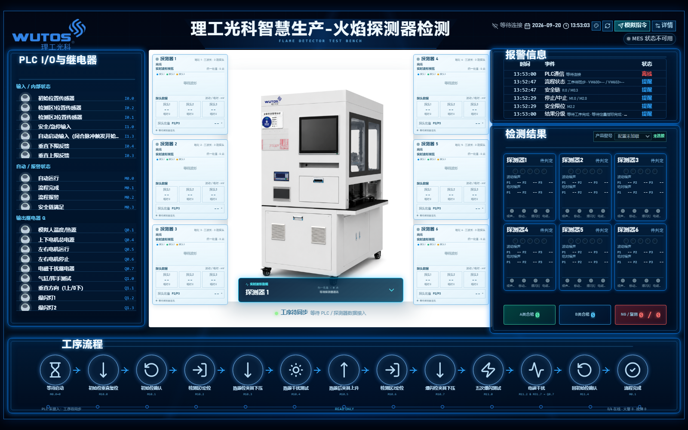

现场主界面采用三列监视布局：

- 左侧：PLC 输入、输出和内部状态，显示点位地址及当前状态；
- 中部：检测台图像和六台探测器实时状态卡片；
- 右侧：报警信息、六台检测结果和 A 类/B 类/不合格统计；
- 底部：PLC 自动工序状态轨道，显示限位、热源、爆闪、EMC、回位和完成步骤。

现场运行时上位机只读取 PLC 工序和探测器状态，不通过该页面直接写入 PLC 输出。

#### 7.4.2 指示灯视觉检测界面

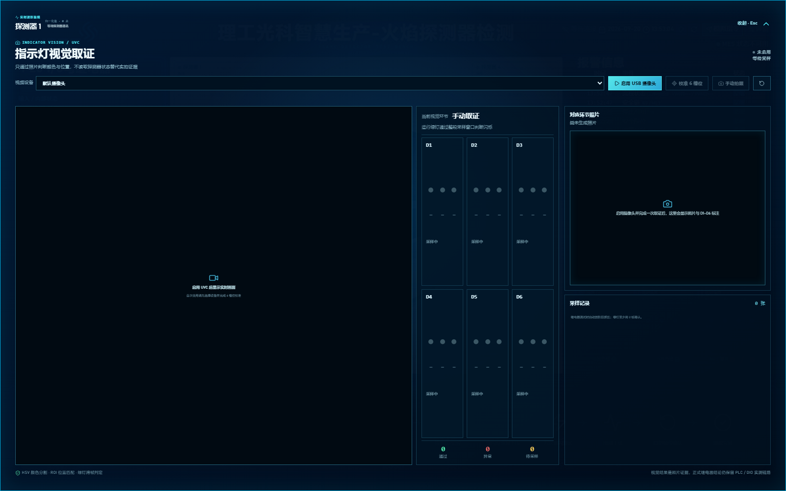

视觉取证界面包含视频区域、摄像头选择、六槽位识别卡、ROI 校准、手动拍照、阶段状态和采样记录。界面用于：

- 选择和启用摄像头；
- 校准 D1-D6 感兴趣区域；
- 显示绿灯、红灯、黄灯状态及槽位判定；
- 按继电器验证阶段自动抓拍；
- 查看对应阶段照片和识别框；
- 将视觉摘要提交至当前批次。

当前界面不包含外壳、标签、二维码和装配完整性检测功能。

#### 7.4.3 设备与波形界面

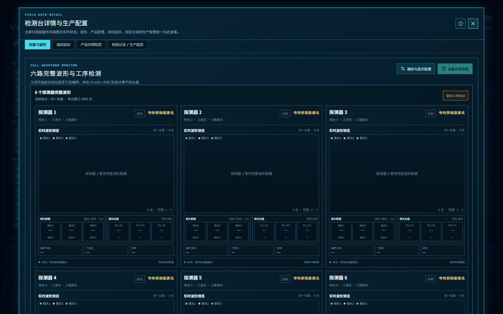

“设备与波形”页面显示六台探测器的实时波形、探头数据、探头比值、通信状态和设备自检入口。主要功能包括：

- 原始/归一化波形显示；
- 探头波动值、绝对值及 P2/P1、P2/P3、P3/P1 比值；
- 设备连接、波形接收和启动状态；
- 波形缓存清除；
- 七步只读设备自检；
- 通信与显示配置入口。

#### 7.4.4 产品型号与检测配置界面

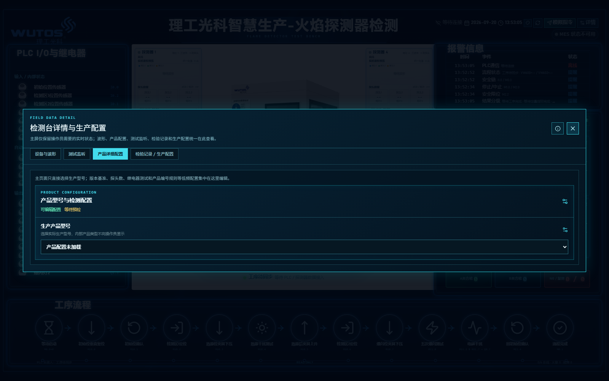

产品配置页面用于维护产品型号、期望探头数、软件版本、灵敏度、产品编码和继电器功能测试规则。生产运行期间产品选择应锁定，防止同一批次使用不同检测基准。

#### 7.4.5 生产检验、标签打印和 MES 界面

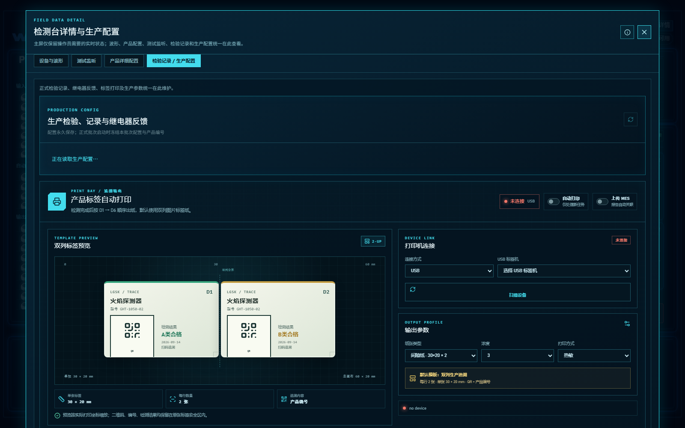

该页面将生产检验配置、继电器反馈、标签打印和 MES 状态集中显示：

- 维护检验标准、检验员、生产参数和继电器反馈；
- 显示 30×20 mm 双列标签版式、二维码和产品编号；
- 配置 USB/WiFi 标签机及打印参数；
- 显示自动打印开关、标签机连接状态、等待/打印/已打印/失败任务；
- 显示 MES 上传状态和待上传任务。

标签机打印完成后仍需人工核对产品编号并贴标；“已打印”不等于“已贴标”。

#### 7.4.6 测试监听界面

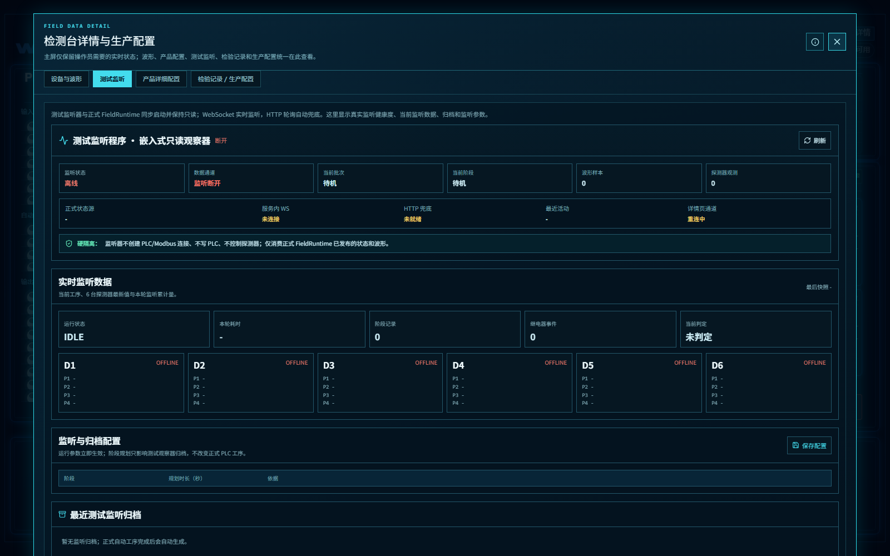

测试监听器用于只读观察正式现场服务发布的工序、阶段计时、波形样本、继电器事件和归档记录。该界面不建立 PLC/Modbus 控制连接，不写入 PLC，不控制探测器。

#### 7.4.7 软件版本与诊断界面

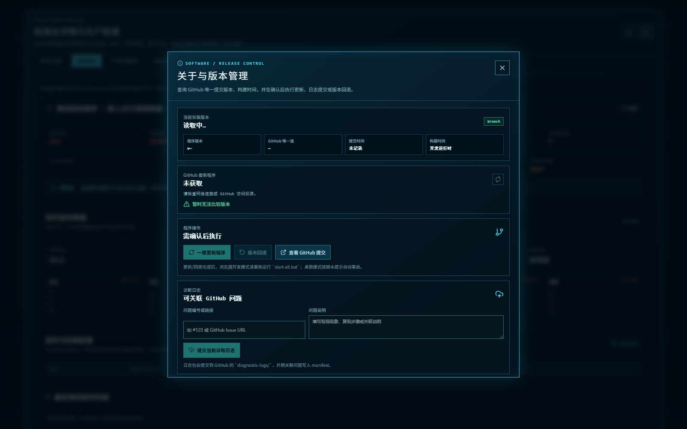

版本管理页面用于显示当前版本、代码提交、远端版本、更新、回退和诊断日志提交状态。版本更新、回退和日志上传应由授权维护人员执行，生产检测过程中不得修改软件版本。

## 8. 软件功能架构与接口

### 8.1 服务端模块划分

| 模块 | 代表文件 | 职责 |
|---|---|---|
| 运行时入口 | `server/src/main.ts` | 启动现场状态服务和统一辅助服务 |
| PLC 过程监测 | `plc-process-monitor.ts`、`plc-program-contract.ts` | S7 只读轮询、DB1/VW 映射、阶段解码和 IO 快照 |
| 探测器服务 | `modbus/flame-detector-service.ts`、`product-aware-flame-detector-service.ts` | 连接、推流、协议解码、启动握手、命令和产品预检 |
| 波形分析 | `closure/field-waveform-analysis.ts` | 噪声、热源、爆闪、EMC、趋势和采样窗口 |
| 视觉检测 | `components/indicator-camera.tsx`、`indicator-vision.ts` | 通用摄像头抓帧、六槽位感兴趣区域、HSV 指示灯判定和视觉证据摘要 |
| 结果判定 | `closure/field-detector-verdict.ts`、`field-final-verdict.ts` | 单台/整批/最终完成门禁和 A/B/NG/复测分类 |
| 生产运行 | `production-run-coordinator.ts` | 批次生命周期、完成时机和生产记录协调 |
| 记录与报告 | `production-inspection-record-store.ts` | HTML/Word 兼容记录、历史查询和导出 |
| 标签 | `label-print-queue.ts` | 六个槽位按批次入队、认领、打印、失败和重试 |
| 继电器反馈 | `relay-functional-test-coordinator.ts`、`relay-feedback-dio.ts` | 火警/故障触点、极性、稳定采样和物理反馈判定 |
| 外部集成 | `mes-publisher.ts`、`mqtt-publisher.ts`、`diagnostic-log-auto-upload.ts` | MES、MQTT 状态/结果和诊断归档上传 |
| 测试观察 | `test-program/*` | 只读监听、阶段计时、波形/结果归档 |
| 安全边界 | `field-runtime-gate.ts`、`request-security.ts` | 运行模式校验、本机接口和桌面变更权限 |

### 8.2 主要 HTTP 接口

| 接口 | 方法 | 说明 |
|---|---|---|
| `/api/health` | GET | 运行状态和外部连接概况 |
| `/api/field/summary` | GET | PLC、波形、产品预检、继电器测试和最终判定汇总 |
| `/api/plc/process-status` | GET | 当前 PLC 工序状态和 IO |
| `/api/flame/devices` | GET | 六台探测器实时状态和波形 |
| `/api/flame/config` | GET/PUT | 探测器通信、波形和分析配置 |
| `/api/product-config` | GET/PUT | 产品型号与批次配置 |
| `/api/indicator-vision/evidence` | POST | 提交当前批次 D1～D6 指示灯视觉证据摘要 |
| `/api/flame/auto-test` | POST | 七步只读自动检测 |
| `/api/production-records` | GET | 生产记录列表、详情和 Word/HTML 导出 |
| `/api/label-print/*` | GET/POST | 标签队列认领、打印成功、失败和重试 |
| `/api/mes/status` | GET | MES 连通性、待上传任务和最近上传状态 |
| `/api/production-config` | GET/PUT | 生产人员、标准、DIO 和相关配置 |
| `/api/mqtt/status` | GET | MQTT 状态和上传队列 |
| `/api/test-program/*` | GET/WS | 测试监听器的只读状态、配置和归档 |

现场服务明确拒绝旧的 `/api/do` 和 `/api/relays/*/do/*` 直写路径，并返回 `FIELD_STATUS_READONLY`。

### 8.3 配置和数据持久化

| 数据 | 默认位置/来源 | 用途 |
|---|---|---|
| PLC 配置 | `server/plc-configs.json` | S7 连接地址、端口、DI/DO 数量和轮询周期 |
| 系统配置 | `server/system-config.json` | 探测器、波形、产品、DIO、MQTT、生产参数 |
| 产品配置 | `server/product-profiles.json` | 型号、版本、探头数和编号规则基准 |
| 生产记录 | 运行时数据目录 | 批次报告、HTML/Word 文档和结果详情 |
| 标签队列 | 运行时数据目录 | 打印任务、租约和失败重试 |
| 测试归档 | `%APPDATA%\FlameDetectorTestProgram\data\archives` | 只读测试观察报告和阶段证据 |
| 诊断日志 | `logs/` 或 Electron 日志目录 | 启动、界面进程、服务端、网络和测试诊断 |

打包桌面程序时，初始配置复制到用户应用数据目录；卸载过程不主动删除运行数据。现场部署应建立配置备份、恢复和变更审批制度。

## 9. 部署、发布与运维

### 9.1 构建与交付

主要命令：

```powershell
npm install
npm install --prefix server
npm run build:web
npm run build:server
npm run build:single-exe
```

单文件桌面程序包含 Electron、界面静态资源、服务端构建产物和服务端依赖；交付包同时生成 SHA-256 校验文件。正式升级、回退和日志上传统一通过 `config/release-source.json` 和 `SoftwareReleaseService` 处理。

### 9.2 现场版本与资料一致性

以下命令用于检查仓库中的 PLC/HMI 资产、上位机源码和受控基线的一致性：

```powershell
npm run verify:field-readiness
npm run verify:field-readiness:strict
```

门禁检查包括：

- PLC `.smart`、AWL、工序流程和 HMI 资产是否存在；
- 资产哈希是否与受控基线一致；
- AWL 是否存在手动安全旁路、垂直限位旁路、EMC 自动输出缺失等问题；
- HMI 是否直接写物理 `Q`、安全限位 `M2.2` 或自动动作 `M29.x`；
- 上位机是否保持现场单一路径、本机绑定、无直接 I/O 回归；
- `field-deployment-manifest.json` 是否保存现场部署版本、资产哈希、CRC、I/O 对照和验收记录索引。

PLC 与 HMI 已完成现场部署。`verify:field-readiness` 的结果反映仓库资料与受控基线的一致性，不作为现场已部署状态的单独判定依据。

### 9.3 运维职责

| 角色 | 责任 |
|---|---|
| 操作员 | 按规程启动、观察、停止、核对报告和标签，完成人工贴标确认，不修改低频配置，不旁路安全条件 |
| 设备/电气维护 | 安全回路、限位、继电器、传感器、接线和机械动作检查 |
| 工艺/质量人员 | 产品型号、版本基准、阈值、复测和放行规则管理 |
| 软件维护人员 | 上位机版本、PLC/HMI 契约、接口、日志和配置备份 |
| 管理员 | 版本冻结、CRC/哈希、FAT/SAT、权限、数据留存和变更审批 |

## 10. 当前验证结果

### 10.1 自动化验证

| 验证项 | 结果 | 说明 |
|---|---|---|
| `npm run build:web` | 通过 | Vite desktop 模式完成构建 |
| `npm run build:server` | 通过 | Node.js/TypeScript 服务端完成编译 |
| `npm test --prefix server` | 完成 | 并行输出阶段出现 Node 测试运行器反序列化异常，未形成稳定业务断言失败 |
| `npx tsx --test test/indicator-label-regression.test.ts` | 2/2 通过 | 指示灯视觉判定和标签原因映射 |
| `npx tsx --test test/label-print-queue.test.ts` | 6/6 通过 | 标签队列、合格/不合格标签和重试 |
| `npm run verify:field-readiness` | 完成 | 资产基线和上位机状态已完成核对；历史静态规则提示已结合最终部署版和现场验收复核关闭，不构成当前生产阻断 |
| `npm run build:single-exe` | 通过 | 已更新安装包并校验 SHA-256 |
| Archify validate/deliver/visual-check | 通过 | 技术路线、功能架构图完成 9 项结构校验和四尺寸视图检查 |
| 现场生产闭环 | 通过 | 检测、判定、报告、标签打印、MES 上传和人工贴标确认已完成生产验证 |


### 10.2 当前现场状态

当前现场状态说明如下：

- PLC 与 HMI 已完成现场部署并作为最终生产版本使用；
- 上位机源码、桌面安装包及现场运行配置已完成交付；
- 仓库中的现场资产基线和统一部署清单已与最终部署状态完成关联；
- PLC/HMI/上位机的工序、I/O、安全、爆闪、EMC 和质量判定语义已完成现场一致性确认；
- 六台探测器通信、产品预检、波形分析、继电器功能测试和指示灯视觉检测均已纳入生产流程；
- 合格/不合格结果可自动形成检验报告，标签任务可自动生成并打印，MES 可自动上传报告附件和产品结果，异常上传任务保留并重试；
- 操作人员完成产品编号核对和人工贴标确认后，批次追溯闭环完成；
- 当前无影响已交付生产使用的 P0/P1 阻断项。

现场自动控制和产品放行以最终部署版本、生产检验记录和公司质量规程为准。后续新增型号、功能和工艺参数调整均按变更管理重新验证。

## 11. 闭环结果与持续优化建议

### 11.1 已完成的关键闭环项

1. **版本与资产闭环**：PLC、HMI、上位机、配置和现场资产基线已与最终部署状态关联管理。
2. **安全与动作闭环**：启动、停止、急停/安全链、限位、回位、热源、爆闪和 EMC 工序已完成现场联调和生产验证。
3. **六台产品检测闭环**：六台探测器可并行完成通信、预检、波形采集、质量判定和结果归档。
4. **视觉与继电器闭环**：继电器反馈和 D1～D6 指示灯视觉检测已进入生产检验和异常处置链。
5. **报告与标签闭环**：检测完成后自动生成检验记录并生成标签任务，标签打印结果可追溯。
6. **MES 与追溯闭环**：检验报告附件和产品结果自动上传 MES，异常任务具备本地保留和自动重试机制。
7. **人工贴标确认闭环**：打印完成后由操作人员核对产品编号并完成贴标确认，形成最终生产追溯闭环。

### 11.2 当前生产应用状态

当前项目已完成交付并投入生产使用，未发现影响现有已验证产品正常检测和放行的未闭环事项。项目当前状态应定义为“生产闭环已完成、持续迭代维护”。

对于软件中已经预留或已配置的更多产品品类，若尚未进入实际生产批次，其后续实机测试属于产品扩展验证，不属于当前检测台项目交付缺口。

### 11.3 持续优化建议

1. 随生产进度验证更多产品型号和探头组合，持续完善产品配置和兼容范围。
2. 根据产线反馈优化界面、波形展示、诊断信息和操作体验。
3. 保持软件、PLC/HMI、配置、I/O 和生产记录的版本关联，发生变更时执行回归验证。
4. 持续完善日常点检、备份恢复、日志留存和异常批次处置机制。
5. 对网络、MES、MQTT 和诊断日志上传保持最小权限和失败重试策略，确保外部服务不可用时不破坏本地质量证据。

## 12. 现场验收与生产闭环确认清单

以下项目均已按最终生产交付口径完成确认：

### 12.1 PLC/HMI 与安全

- [x] 现场 PLC 工程版本、CRC 和部署记录已归档；
- [x] 现场 HMI 工程版本、变量权限、页面版本和部署记录已归档；
- [x] `M2.3` 启动仅在安全正常、无报警、未运行时生效；
- [x] `M2.0` 停止能清除自动步骤和所有危险输出；
- [x] `I1.0` 断开时报警、停机、输出清除、水平暂停有效；
- [x] `I0.3/I0.4` 每个垂直动作均能反馈完成，超时会停机报警；
- [x] `Q0.5` 与 `Q0.6` 不会同时有效；
- [x] HMI 不可直接写 `Q`、`M2.2` 和自动动作 `M29.x`；
- [x] EMC 实际输出点位与接线、HMI 和上位机一致；
- [x] 五次爆闪或最终确认的节拍与所有采集窗口一致。

### 12.2 工序与质量

- [x] 初始化、热源、爆闪、EMC、回初始位和完成顺序不可跳过；
- [x] EMC 后未回初始位时报告门禁保持阻止；
- [x] 六台探测器缺一、离线、故障、过期或 `UNKNOWN` 时不能放行；
- [x] 版本、探头数、灵敏度和继电器反馈验证结果进入批次记录；
- [x] 噪声、热源、爆闪、EMC 采样数量和指标齐全；
- [x] A/B/不合格/需复测分级与质量规程一致；
- [x] D1-D6 指示灯视觉结果、抓拍数量和批次号进入检验记录；
- [x] STOP、急停、通信中断和采样不足都能阻止当前批次放行；
- [x] 合格和不合格批次均自动生成检验报告；
- [x] 标签任务自动生成，合格标签和不合格标签按质量规程分别处理；
- [x] 报告附件和产品结果自动上传 MES，失败任务可重试；
- [x] 人工核对产品编号后完成贴标，并记录贴标确认人和确认时间。

### 12.3 数据与运维

- [x] 生产记录、报告和审计链可查询、验证和导出；
- [x] 生产记录可生成 HTML/Word 兼容文件；
- [x] 标签队列支持认领、打印成功、失败、重试和批次隔离；
- [x] USB/WiFi 标签机连接、自动打印和打印状态回写已验证；
- [x] MES 报告附件、产品结果和待上传队列已验证；
- [x] 软件日志包含启动、界面进程、服务端、网络和关键异常；
- [x] 配置、版本、CRC、哈希、操作人员和验收记录可恢复；
- [x] 单文件桌面程序安装、升级、回退和运行数据保留已验证。

## 13. 附录：主要项目证据索引

### 13.1 工序和 PLC

- `PLC.awl`：仓库中的受控目标 PLC 程序和网络逻辑。
- `IO映射.txt`：基础 DI/DO 点位说明；现场最终 I/O、EMC 输出点位和接线关系已按最终部署版及验收记录完成统一。
- `config/plc-hmi-upper-contract.json`：PLC/HMI/上位机阶段、点位、状态寄存器和质量门禁契约。
- `D:\code\PLC\SMART200-FLAME\Process_4Stage_DIDO_IMPORT.awl`：现场最终 PLC 资料/对照文件，已与最终部署版本完成关联归档。
- `D:\code\PLC\SMART200-FLAME\工序流程.txt`：现场工序流程说明，最终生产节拍和 EMC 语义以已部署版本及验收记录为准，已完成闭环确认。

### 13.2 上位机与服务端

- `index.tsx`：选择现场主界面或测试观察界面入口。
- `components/FieldProcessStatusApp.tsx`：现场只读主页面、HTTP/WS 状态同步和详情面板。
- `components/WutosDashboard.tsx`：工序、探测器、波形、报警和结果主屏。
- `components/FlameDetectorWorkbench.tsx`：六台探测器波形、通信和七步只读自检。
- `components/indicator-camera.tsx`、`components/indicator-camera-geometry.ts`：通用摄像头、六槽位感兴趣区域校准、HSV 指示灯分析和视觉抓拍。
- `server/src/closure/field-status-server.ts`：现场状态运行时和只读接口。
- `server/src/indicator-vision.ts`：视觉报告规范化、批次绑定和绿灯/红灯正式判定规则。
- `server/src/product-aware-field-runtime.ts`：产品感知现场服务、生产记录、标签和产品编码。
- `server/src/closure/field-waveform-analysis.ts`：波形采集和质量分析。
- `server/src/closure/field-detector-verdict.ts`、`field-final-verdict.ts`：单台、整批和最终结果门禁。

### 13.3 配置、验证和历史资料

- `server/system-config.json`：当前通信、波形、产品、DIO、MQTT 和生产配置。
- `server/product-profiles.json`：四类产品档案。
- `config/field-asset-baseline.json`：现场资产哈希基线。
- `config/field-deployment-manifest.json`：现场部署统一编号、版本、SHA-256、CRC、部署日期、维护人员和验收资料索引。
- `config/field-deployment-status.json`：PLC/HMI 部署和资料核验状态；现场部署状态以当前现场记录为准。
- `scripts/field-readiness.mjs`：现场静态发布门禁。
- `docs/architecture/`：功能架构和时间轴图表源文件。
- `docs/examples/生产检验记录范例-6台-更新版.doc`：项目原始合格检验记录样例。
- `production-records/field-waveform-1788752580708-2.html`：项目实际生产不合格检验记录样例。
- `docs/architecture/report-samples-real/`：上述原始记录的页面预览图。
- `docs/architecture/ui-screenshots/`：上位机各界面实际运行截图。
- `docs/2026-09-09-field-repeatability-optimization-report.md`：六台同批重复测试、基础设施异常分类和波形重复性分析。
- `docs/操作人员操作指南.md`：现场只读监测版操作和异常处理要求。

## 14. 最终建议

本项目已完成 PLC/HMI、上位机、六台探测器通信与质量判定、指示灯视觉检测、检验报告、标签打印、MES 上传和人工贴标确认的完整生产闭环，并已交付生产使用。当前不存在影响已验证产品正常生产检测的未闭环阻断项。

后续工作定位为持续优化：随生产计划验证更多产品品类和配置，继续扩展兼容范围，并根据产线实际需求新增功能、优化界面和维护机制。后续扩展不影响本项目当前“已完成交付、生产闭环完成”的结论。
